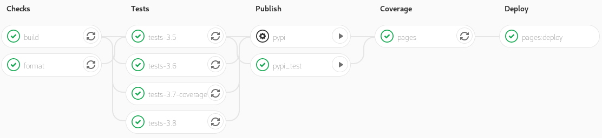

# Silkaj v0.8.0 release

## Introduction
The Silkaj team is pleased to announce the release of Silkaj 0.8.0. A new team member joined us at the beginning of this development cycle: Matograine. We highly appreciate his commitment, his improvements of the transaction code and his work on the checksum.
This release comes along with a number of new features and improvements.
The most important of them are highlighted in this article, if you are looking for a comprehensive list of changes, check out the [changelog](https://git.duniter.org/clients/python/silkaj/blob/dev/CHANGELOG.md).

Version 0.8.0 was done in 145 commits, and features seven major improvements:
1. `membership`: We developed a command to allow users to send membership documents.
2. Identity choice: We can now manually choose the desired identity among other identities.
3. Multi-recipients transactions: Users can simultaneously send a different amount of Ğ1 to different recipients.
4. Display improvements for `tx` and `balance`: For a better overview, we modified the `tx` table and added a `balance` table.
5. Public key checksum display and verification: For security purposes, Silkaj displays and verifies the checksum.
6. `verify`: We set up a command to check whether a block is valid.
7. Dev Env: We set up a solid development environment for Poetry, CI/CD, and Tests.
  - A. Poetry: We migrated to Poetry.
  - B. CI/CD: We set up a pipeline to run automatic jobs.
  - C. Tests: We started to write tests.

## 1. Membership
After the transaction and the certification commands, the much awaited `membership` command is now available.

Users can send their first membership request to be a certified member of the Ğ1 community. As certified members have to renew their membership each year, this command allows to send the renewal application in question. It displays the expiration date of the current membership and indicates the identification blockstamp of the user. In the event a user forgets that they have already sent a membership request, a pop up displays if there is a pending membership request in the mempool.

```bash
silkaj membership
Please enter your Scrypt Salt (Secret identifier):
Please enter your Scrypt password (masked):
You will be asked to approve Ğ1 license. Would you like to display it? [y/N]: n
Do you approve Ğ1 license? [y/N]: y
╒════════════════════════════════════════════════════╤═══════════════════════════════════════════════════╕
│ Expiration date of current membership              │ in 3 weeks                                        │
├────────────────────────────────────────────────────┼───────────────────────────────────────────────────┤
│ Number of pending membership(s) in the mempool     │ 1                                                 │
├────────────────────────────────────────────────────┼───────────────────────────────────────────────────┤
│ Pending membership documents will expire           │ in 1 year                                         │
├────────────────────────────────────────────────────┼───────────────────────────────────────────────────┤
│ User Identifier (UID)                              │ moul                                              │
├────────────────────────────────────────────────────┼───────────────────────────────────────────────────┤
│ Public Key                                         │ GfKERHnJTYzKhKUma5h1uWhetbA8yHKymhVH2raf2aCP:J1k  │
├────────────────────────────────────────────────────┼───────────────────────────────────────────────────┤
│ Block Identity                                     │ 0-E3B0C44298FC1C149AFBF4C8996FB92427AE41E4649B93… │
├────────────────────────────────────────────────────┼───────────────────────────────────────────────────┤
│ Identity published                                 │ March 8, 2017                                     │
├────────────────────────────────────────────────────┼───────────────────────────────────────────────────┤
│ Expiration date of new membership                  │ in 1 year                                         │
├────────────────────────────────────────────────────┼───────────────────────────────────────────────────┤
│ Expiration date of new membership from the mempool │ in 2 months                                       │
╘════════════════════════════════════════════════════╧═══════════════════════════════════════════════════╛
Do you confirm sending a membership document for this identity? [y/N]:
```

## 2. Identity choice
When using the commands `wot`, `cert`, and `membership`, Silkaj used to select the first identity on the list. As this can lead to fishing, we added a new feature to pick the identity of your choice. Now, you can use the `uid` and the `pubkey` to certify an identity and study its status in the Web of Trust.
Please note that identities can have the same user identifier and the same public key.

```bash
silkaj -gt wot moul
|   id | uid       | pubkey                                           | timestamp             |
|------+-----------+--------------------------------------------------+-----------------------|
|   00 | moul1     | WULdRTxspGdJzrs4vpZsWLGWsu37DjqoHyhGDFr5amh:45s  | 614118-00000EE8DFC0F… |
|   01 | moul2     | WULdRTxspGdJzrs4vpZsWLGWsu37DjqoHyhGDFr5amh:45s  | 614227-00000ED689406… |
|   10 | moul1     | 3rp7ahDGeXqffBQTnENiXEFXYS7BRjYmS33NbgfCuDc8:DFQ | 614227-00000ED689406… |
|   20 | moul-test | 5B8iMAzq1dNmFe3ZxFTBQkqhq4fsztg1gZvxHXCk1XYH:baK | 167750-0000A51FF952B… |
Which identity would you like to select (id)?:
```

## 3. Transactions: multi-recipients & different amounts of Ğ1
Thanks to Matograine, users can now send different amounts of Ğ1 to multiple recipients in the same document.
Working on this feature offered us the opportunity to rethink and clean up the CLI and the code related to the `tx` command.
However, further efforts are required to build a more solid code base foundation.
<br />

v0.8.0 comes with three **breaking changes** and four small options:
- `--output` was renamed to `--recipient`
- recipients public key are splits with the option `--recipient` instead of a colon character.
- The public key's checksum separator `!` is being replaced by the colon.
- small options have been introduced:
  - `-a/--amount`
  - `-d/--amountUD`
  - `-r/--recipient`
  - `-c/--comment`
<br />

The follow examples illustrates the change operated on the CLI.
With the previous version of Silkaj, the following procedure was operated to send one unit to `pubkey1` and `pubkey2`:

```bash
silkaj tx --amount 1 --output <pubkey>1!<checksum1>:<pubkey2>!<checksum2>
```

With the current version of Silkaj, the following procedures are operated to send one unit to `pubkey1` and two units to `pubkey2`:
```bash
silkaj tx --amount 1 --recipient <pubkey1>:<checksum1> --amount 2 --recipient <pubkey2>:<checksum2>
```

With small options:
```bash
silkaj tx -a 1 -r <pubkey1>:<checksum1> -a 2 -r <pubkey2>:<checksum2>
```

In the case one amount is passed, the same amount will be send to the passed recipients. The `--allSources` option is only working with one recipient.

## 4. Display improvements for `tx` and `balance`
We merged the relative and absolute amounts into one cell. This applies to the cells: initial balance, total transaction amount, balance after the transaction, and individual amounts.

To send a different amount of Ğ1 to multi-recipient proceed following:
```bash
silkaj tx -d 1 -d 2 \
-r CrznBiyq8G4RVUprH9jHmAw1n1iuzw8y9FdJbrESnaX7 \
-r d88fPFbDdJXJANHH7hedFMaRyGcnVZj9c5cDaE76LRN:FVm \
-c "Test different amounts to two different recipients"
╒════════════════════════════════════════════╤════════════════════════════════════════════════════╕
│ Initial balance (unit|relative)            │ 2207757.83 ĞTest | 145.63 UD ĞTest                 │
├────────────────────────────────────────────┼────────────────────────────────────────────────────┤
│ Total transaction amount (unit|relative)   │ 45480.0 ĞTest | 3.0 UD ĞTest                       │
├────────────────────────────────────────────┼────────────────────────────────────────────────────┤
│ Balance after transaction (unit|relative)  │ 2162277.83 ĞTest | 142.63 UD ĞTest                 │
├────────────────────────────────────────────┼────────────────────────────────────────────────────┤
│ From (pubkey)                              │ 5B8iMAzq1dNmFe3ZxFTBQkqhq4fsztg1gZvxHXCk1XYH:baK   │
├────────────────────────────────────────────┼────────────────────────────────────────────────────┤
│ From (id)                                  │ moul-test                                          │
├────────────────────────────────────────────┼────────────────────────────────────────────────────┤
│ To (pubkey)                                │ CrznBiyq8G4RVUprH9jHmAw1n1iuzw8y9FdJbrESnaX7:8Sj   │
├────────────────────────────────────────────┼────────────────────────────────────────────────────┤
│ To (id)                                    │ Elois                                              │
├────────────────────────────────────────────┼────────────────────────────────────────────────────┤
│ Amount (unit|relative)                     │ 15160.0 ĞTest | 1.0 UD ĞTest                       │
├────────────────────────────────────────────┼────────────────────────────────────────────────────┤
│ To (pubkey)                                │ d88fPFbDdJXJANHH7hedFMaRyGcnVZj9c5cDaE76LRN:FVm    │
├────────────────────────────────────────────┼────────────────────────────────────────────────────┤
│ To (id)                                    │ matograine-G1Test                                  │
├────────────────────────────────────────────┼────────────────────────────────────────────────────┤
│ Amount (unit|relative)                     │ 30320.0 ĞTest | 2.0 UD ĞTest                       │
├────────────────────────────────────────────┼────────────────────────────────────────────────────┤
│ Comment                                    | Test different amounts to two different recipients │
╘════════════════════════════════════════════╧════════════════════════════════════════════════════╛
Do you confirm sending this transaction? [yes/no]:
```

The balance of a given public key is now displayed in a table. Bellow you can find an example of such a display.

```bash
silkaj balance 78ZwwgpgdH5uLZLbThUQH7LKwPgjMunYfLiCfUCySkM8
╒═════════════════════════════════════╤══════════════════════════════════════════════════╕
│ Balance of pubkey                   │ 78ZwwgpgdH5uLZLbThUQH7LKwPgjMunYfLiCfUCySkM8:4VT │
├─────────────────────────────────────┼──────────────────────────────────────────────────┤
│ Blockchain (unit|relative)          │ 94322.48 Ğ1 | 9220.18 UD Ğ1                      │
├─────────────────────────────────────┼──────────────────────────────────────────────────┤
│ Pending transaction (unit|relative) │ 100.0 Ğ1 | 9.78 UD Ğ1                            │
├─────────────────────────────────────┼──────────────────────────────────────────────────┤
│ Total amount (unit|relative)        │ 94422.48 Ğ1 | 9229.96 UD Ğ1                      │
├─────────────────────────────────────┼──────────────────────────────────────────────────┤
│ Total relative to M/N               │ 13.35 x M/N                                      │
╘═════════════════════════════════════╧══════════════════════════════════════════════════╛
```

## 5. Pubic key checksum display, verification, and checksum command
For security purposes, Silkaj now displays the checksum associated with the public key, and verifies it when passed to a command.
If a public key or an authentication method is passed to the newly introduced `checksum` command, the later generates the associated checksum to the public key. if a public key and a checksum are passed, Silkaj displays whether the checksum is valid or not.

## 6. `verify`
We introduced the new `verify` command to check whether the signatures of the blocks of the blockchain are valid since there was a bug in the cryptography library of Duniter.
Cf [Forum topic](https://forum.duniter.org/t/duniter-utilise-une-ancienne-version-buggee-de-tweetnacl-que-faire/6633) and [Duniter ticket](https://git.duniter.org/nodes/typescript/duniter/-/issues/1390)

To verify blocks proceed following:

```bash
silkaj verify
Processing blocks verification  [####################################]  100%
Within 0-342803 range, blocks with a wrong signature: 15144 31202 85448 87566 90830 109327 189835 199172 221274 253582
```

## 7. Development Environment
### A. Poetry


We migrated the packaging and the dependency management tool from Pipenv to Poetry since Pipenv has been quite problematic recently and is also more suitable for larger projects.

In comparison, [Poetry](https://python-poetry.org/) is a well thought and stable tool which has been released by the end of 2019. In the former development environment, we had to define the dependencies twice in the `requirements.txt`, `setup.{py,cfg}`, `Pipenv` files. Poetry, however, supports the `pyproject.toml` file standardized by the Python project and is able to define the dependencies at once.

If you would like to install Silkaj for development purposes, please follow [this tutorial](https://git.duniter.org/clients/python/silkaj/-/blob/dev/doc/install_poetry.md). You may also interested by checking the newly introduced [contribution process documentation `CONTRIBUTING.md`](https://git.duniter.org/clients/python/silkaj/-/blob/dev/CONTRIBUTING.md).

### B. Automatic container generation
We set up an [automated pipeline to generate containers](https://git.duniter.org/docker/python3/poetry/) for all supported Python versions: 3.5, 3.6, 3.7, and 3.8. These containers are based on official Python containers, which use Debian Buster Slim. On top of that, Poetry, `libsodium`, and other development tools are installed to continually check and test Silkaj in its pipeline. Since DuniterPy uses the same containers, it also profits from this automated container generation.

### C. CI/CD pipelines
Based on the containers set out above, a continuous integration and delivery pipeline has been set up to automatically run:
- Checks: format, build,
- Tests on all supported Python versions,
- Release publication automation on PyPI and PyPI test.



## 7. Tests
We started to write tests to ensure that all features of Silkaj are still functional when changing the code.
However, in order to have all Silkaj commands fully tested, further efforts are required.
During this development cycle, the test coverage raised from 37% to 69% and Silkaj is now covered by more than hundred tests.

## Outlook
Silkaj is compatible with a range of Python versions. Currently, it can be used with Python 3.5, 3.6, 3.7, and 3.8. v0.8.x will be the last releases with Python 3.5 support. In v0.9.0, we will support Python 3.6, 3.7, 3.8, and 3.9.

Since there is a deadline for packaging Silkaj and DuniterPy into Debian Bullseye (v11), we are putting all our efforts into the upcoming packaging. As for the coming version, DeathReaper, the `excluded` command, for which the crowdfunding has been completed, and the newly revamped `info` command will be stabilized and automatic tests will be written.

@ManUtopiK revamped the [website of Silkaj](https://mystifying-nobel-66ae54.netlify.app) in which you can look up all the presentations, the major features and documentations related to Silkaj. We are working on integrating the website into the project.

For further details check out the presentations of the [RML14](https://rml14.monnaielibreoccitanie.org/). The oral presentations are in French and the slides in English:
- [Moul's: How to contribute to Silkaj](https://git.duniter.org/moul/slides/#rml14-toulouse-28th-november-2019)
- [Matograine's: Envoyer des transactions exotiques avec Silkaj](https://www.youtube.com/watch?v=Fbwy5ovEkSg)

### Thanks
@moul, @matograine
